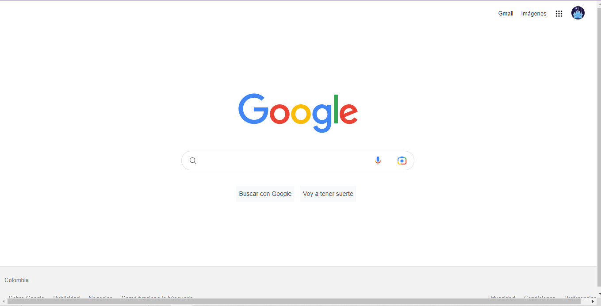

# clon-google
Proyecto creado en TecnolochicasPro simulando la pagina principal del navegador de google
******
Poniendo en practica lo aprendido en el bootcamp logré realizar un clon del explorador de google 
## 1. Intro
El proyecto fue creado con **HTML y CSS**. Se trata del navegador más usado: la interfaz Google
* Puedes visitar el sitio en el siguiente enlace

**Inspirate de la realización de este proyecto, utiliza tu destreza para demostrar que tu futuro es ser desarrolladora frontend😀**

## Contenido del proyecto
1. Header
Sección que muestra el menú y foto de perfil
2. Main
Contiene los elementos centrales del buscador
3. Footer
Incluye hipervinculos al final de la página

Realizado por Luisa Fernanda Porras López.⭐
